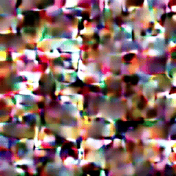
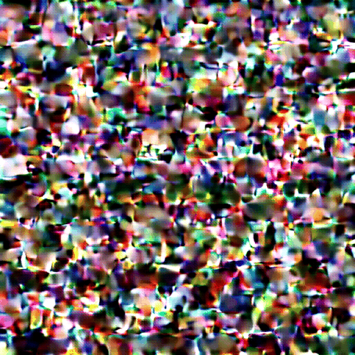

<div align="center">

# LTX-Video 13B on IBM POWER8

[](https://github.com/Scottcjn/ltx-video-power8)
[](https://python.org)
[](LICENSE)
[](https://huggingface.co/docs/diffusers)

**World's First 13B Video Diffusion Model on PowerPC Architecture**

*Run state-of-the-art AI video generation on IBM POWER8 servers with 320GB RAM*

[Features](#features) • [Quick Start](#quick-start) • [Hardware](#hardware-requirements) • [Results](#results) • [Technical Details](#technical-details)

</div>

---

## Why This Matters

- **First Ever**: No one has run a 13B parameter video diffusion model on PowerPC before
- **Legacy Hardware Revival**: Your IBM POWER8 server can now generate AI videos
- **320GB RAM Advantage**: Fits entire model in memory - no GPU required
- **Open Source**: Full pipeline, not just inference scripts

## Features

- **QK-Norm Key Mapping** for distilled 13B model architecture
- **Latent Packing/Unpacking** for transformer input format
- **POWER8 Stack Workaround** for multi-threading stability
- **Hybrid Threading** - 5.7× speedup with smart thread switching

## Quick Start

```bash
# Clone the repo
git clone https://github.com/Scottcjn/ltx-video-power8.git
cd ltx-video-power8

# Download models (you need both)
# 1. 13B distilled model → ~/models/ltx-video-13b/ltxv-13b-0.9.8-distilled.safetensors
# 2. Full LTX-Video model → ~/models/ltx-video-full/

# Run inference
cd scripts
python3 ltx_13b_hybrid.py
```

## Hardware Requirements

| Component | Minimum | Recommended |
|-----------|---------|-------------|
| **CPU** | IBM POWER8 | POWER8 S824 (dual 8-core) |
| **RAM** | 64GB | 320GB |
| **Storage** | 50GB | 100GB SSD |
| **OS** | Ubuntu 20.04 | Ubuntu 20.04 LTS |

## Model Architecture

The 13B distilled LTX-Video model uses different key names than standard diffusers:

| Checkpoint Key | Diffusers Key |
|---------------|---------------|
| `patchify_proj.*` | `proj_in.*` |
| `attn*.q_norm.*` | `attn*.norm_q.*` |
| `attn*.k_norm.*` | `attn*.norm_k.*` |
| `adaln_single.*` | `time_embed.*` |

Our scripts handle this mapping automatically.

## Scripts

### `ltx_13b_full.py`
Complete single-threaded pipeline. Safe but slow.
- Resolution: 256×256 | Frames: 9 | Steps: 4
- Time: ~30 seconds

### `ltx_13b_hybrid.py` ⭐ Recommended
Hybrid multi-threaded pipeline with **5.7× speedup**.
- Multi-threading for transformer (safe on POWER8)
- Single-thread for VAE decode (required)
- Time: ~65 seconds vs 370 seconds

### `ltx_13b_hires.py`
High-resolution generation.
- Resolution: 512×512 | Frames: 17 | Steps: 8
- Time: ~54 minutes

## Results

| Configuration | Resolution | Frames | Time | Output |
|--------------|------------|--------|------|--------|
| Single-thread | 256×256 | 9 | 30s | 511KB |
| **Hybrid** | **256×256** | **9** | **65s** | **531KB** |
| High-res | 512×512 | 17 | 54min | 3.9MB |

### Example Outputs

<table>
<tr>
<td align="center">
<br>
<sub><b>256×256 Preview</b><br>"A glowing crystal rotating slowly in darkness"</sub>
</td>
<td align="center">
<br>
<sub><b>512×512 High Resolution</b><br>"A majestic phoenix rising from flames"</sub>
</td>
</tr>
</table>

## Technical Details

### POWER8 Stack Corruption Workaround

POWER8 exhibits stack smashing errors with multi-threaded PyTorch in certain code paths (particularly VAE decode):

```python
# Force single-threaded for VAE
os.environ["OMP_NUM_THREADS"] = "1"
torch.set_num_threads(1)
```

The hybrid script dynamically switches between multi-threaded (transformer) and single-threaded (VAE) modes.

### Latent Packing

The diffusers transformer expects pre-patchified input:

```python
def pack_latents(latents, patch_size=1, patch_size_t=1):
    # [B, C, F, H, W] → [B, F*H*W, C]
    ...
```

### RoPE Dimensions

Rotary position embeddings expect **latent-space** dimensions, not video dimensions:

```python
# Correct: pass latent dimensions
num_frames = (FRAMES - 1) // 8 + 1  # latent frames
height = RESOLUTION // 32           # latent height  
width = RESOLUTION // 32            # latent width
```

## Dependencies

```
torch>=2.1.0
diffusers>=0.32.0
transformers>=4.39.0
safetensors
pillow
numpy
```

## Related Projects

| Project | Description |
|---------|-------------|
| [llama-cpp-power8](https://github.com/Scottcjn/llama-cpp-power8) | AltiVec/VSX optimized llama.cpp for POWER8 |
| [nvidia-power8-patches](https://github.com/Scottcjn/nvidia-power8-patches) | Modern NVIDIA drivers for POWER8 via OCuLink |
| [power8-projects](https://github.com/Scottcjn/power8-projects) | Ubuntu 22.04 build, PSE LLM, Darwin cross-compile |

## Acknowledgments

- [Lightricks](https://github.com/Lightricks/LTX-Video) for the LTX-Video model
- [Hugging Face](https://huggingface.co/) for diffusers library
- IBM for POWER8 architecture documentation

## License

MIT License

---

<div align="center">

**Made with ⚡ by [Elyan Labs](https://elyanlabs.ai)**

*Proving that legacy hardware can run cutting-edge AI*

</div>


## 中文简介

Elyan Labs POWER8/PowerPC 项目 - 为 IBM POWER 系统和复古 Mac 提供现代 AI 支持。

Contributed by eelaine-wzw
